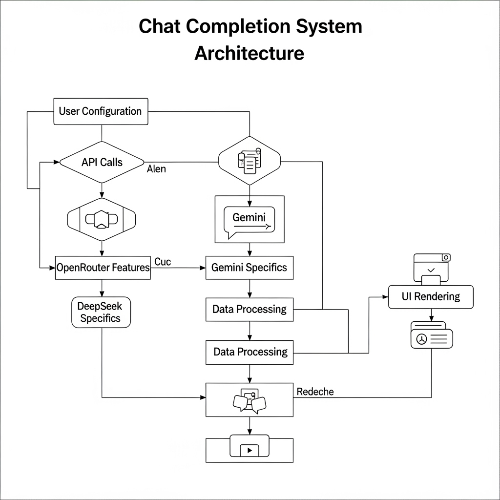

# OpenRouter / Gemini / DeepSeek 从配置到流式输出

本文梳理 Cherry Studio 中，从配置 API Key 到用户输入产生流式输出的完整路径，重点说明 OpenRouter 是否做“转化”，以及 Gemini、DeepSeek 是否需要分别处理。

## Mermaid 流程图

## 端到端说明

- Provider 初始化：在设置中选择 `openrouter/gemini/...` 并填入 `apiKey/apiHost`。运行时通过 `aiCore/provider/providerInitialization.ts` 注册 Provider，`providerConfig.ts#providerToAiSdkConfig` 统一 baseURL、apiKey、别名。
- 参数构建：`prepareParams/parameterBuilder.ts#buildStreamTextParams` 生成 AI SDK 参数（messages/system、maxTokens、温度/TopP、tools、providerOptions）。
  - 推理/思考：`aiCore/utils/reasoning.ts` 按供应商与模型产生 `reasoning/thinking` 相关字段。
  - 内置搜索：`aiCore/utils/websearch.ts` 为 OpenRouter/Gemini 等注入搜索配置（OpenRouter 为 `plugins: [{ id:'web', ... }]`）。
- 执行与中间件：`aiCore/index_new.ts` 使用 `createExecutor(...).streamText(...)`；必要时注入中间件（模拟流/思考提取）。
- 流事件适配：`aiCore/chunk/AiSdkToChunkAdapter.ts` 将 AI SDK 的 `text-* / reasoning-* / tool-* / source / finish` 统一为 ChunkType；UI 订阅 TEXT_DELTA/THINKING_* 实时更新。
- 用量/费用：`FinalChunkConsumerMiddleware.ts` 累计 tokens；OpenRouter 特有的 `cost` 字段也被汇总展示。

## OpenRouter 是否“转化”

- OpenRouter 由 `@openrouter/ai-sdk-provider` 提供统一 Provider 能力。本仓库仅做参数标准化与事件适配，不改变其语义；`citations`、`cost` 等字段被识别并原样纳入统一流程。

## Gemini 与 DeepSeek 区别

- 入参需分别处理：
  - Gemini 使用 `thinkingConfig`（`includeThoughts`、`thinkingBudget`）；搜索模型由规则开启。
  - DeepSeek 依供应商选择 `reasoning` 或 `enable_thinking/thinking`（如 OpenRouter vs DashScope/Doubao）。
- 出参已统一：适配器将两者的流事件映射为相同的 ChunkType，UI 无需分叉解析。

## 关键代码位置

- 流调用入口：`src/renderer/src/services/ApiService.ts`
- 参数/能力：`src/renderer/src/aiCore/prepareParams/*`, `src/renderer/src/aiCore/utils/{reasoning,websearch,options}.ts`
- Provider：`src/renderer/src/aiCore/provider/{providerInitialization,factory,providerConfig}.ts`
- 事件适配：`src/renderer/src/aiCore/chunk/AiSdkToChunkAdapter.ts`
- 用量统计：`src/renderer/src/aiCore/legacy/middleware/common/FinalChunkConsumerMiddleware.ts`
